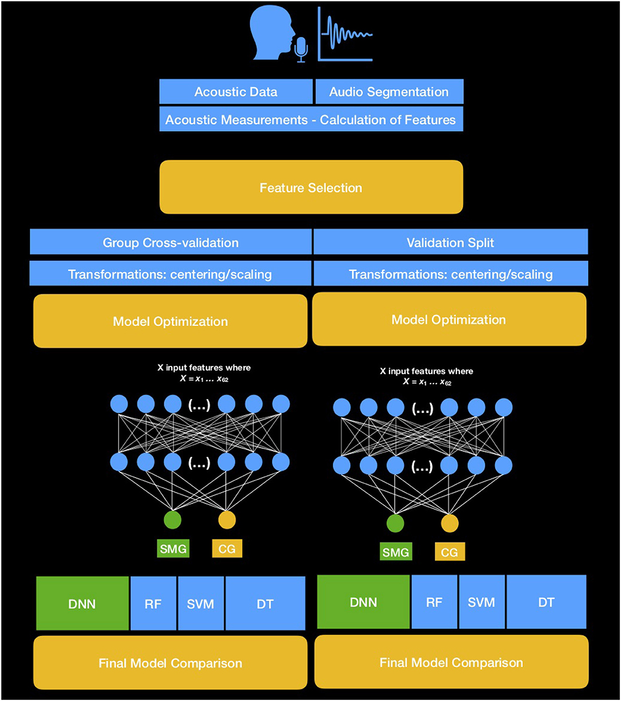

Journal paper available at [Frontiers in Communication](https://www.frontiersin.org/articles/10.3389/fcomm.2019.00064/full)

* Update (12/23/19): Moved from Gitlab to Github.

# Introduction
This paper contains code for comparing different machine learning approaches for the identification of the dialect of the speaker.

# Prerequisites
This project requires scikit-learn, TensorFlow, and Keras, data are analyzed using NumPy, pandas, and visualize with Matplotlib. Most of these packages are included in the Anaconda Environment. 

To Install Anaconda, please visit the [official website](https://www.anaconda.com/distribution/) for instructions. 

To install [Keras]

> conda install -c keras

# Development
The original code was written using Jupyter Notebooks. The current form is employed 

# Data Availability
The data contain information about speakers' productions that may be employed to identify the speakers. Therefore, they cannot be released along with the code of this project, based on the Ethics Agreement. Nevertheless, you may use the code using your own data.

# Ethics Statement
Data for this study were collected during 2011 in Nicosia and Athens as part of a sociolinguistics study that involved collecting information about Greek dialects. A total of 40 healthy female adult speakers participated voluntarily in the study, by providing a short recording of their voice; the task of the recording was comfortable, not stressful, and relatively short; also, it did not put speakers' health and physical condition in risk in any way. For these reasons, further ethics approval was not required. Nevertheless, all participants provided written informed consent.

# Author Contributions
CT conducted the designed and run the experiments, conducted the statistical analysis, and prepared the manuscript.

# Funding
Funding was received from the research project Transcranial Direct Current Stimulation for Primary Progressive Aphasia conducted at Johns Hopkins University (NCT:02606422) PI Kyrana Tsapkini and from Riksbankens Jubileumsfond–The Swedish Foundation for Humanities and Social Sciences, through the grant agreement no: NHS 14-1761:1 PI Dimitrios Kokkinakis.

# Conflict of Interest
The author declares that the research was conducted in the absence of any commercial or financial relationships that could be construed as a potential conflict of interest.

